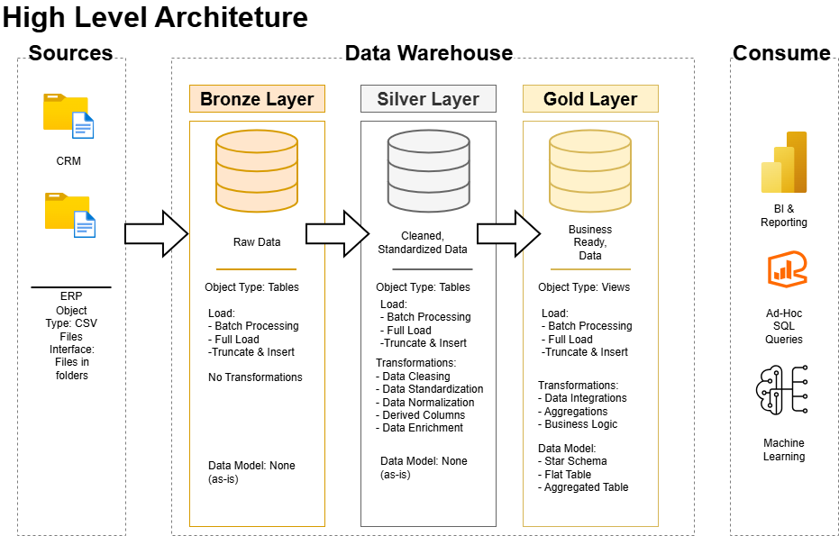
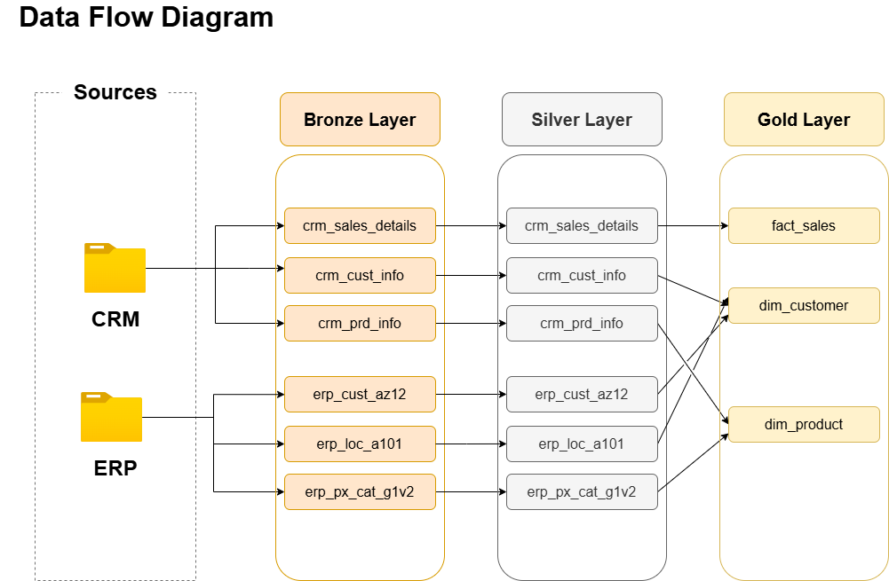
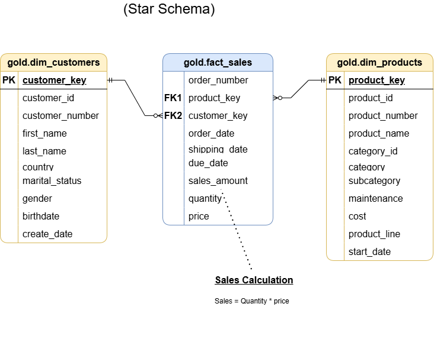

# SQL Data Warehouse Project

This project is an end-to-end data warehouse built with SQL Server. It consolidates sales data from two source systems, CRM and ERP, and transforms the raw CSV files into a clean data model for reporting and analysis.

The project covers the main stages of a data engineering workflow: data ingestion, cleansing, integration, dimensional modeling, and data quality validation. It was developed as a hands-on project while following Baraa Khatib Salkini's SQL course, with some adjustments and documentation added throughout the process.

## Data Architecture

The warehouse follows the Medallion Architecture, organized into Bronze, Silver, and Gold layers.



1. **Bronze layer:** stores the source data in its original form. CSV files from the CRM and ERP systems are loaded into SQL Server tables without business transformations.
2. **Silver layer:** cleans and standardizes the data. This includes removing duplicates, handling missing or invalid values, normalizing text fields, correcting dates, and integrating related records.
3. **Gold layer:** exposes business-ready views in a star schema. These views are designed for analytical queries, dashboards, and reporting.

The complete flow from the source files to the analytical model is shown below.



## Project Objective

The goal is to build a modern SQL Server data warehouse that provides a consistent view of customers, products, and sales. Data from the CRM and ERP systems is combined into a single model so that analysts can answer business questions without working directly with the raw source files.

The project focuses on the latest available data. Historical tracking, such as slowly changing dimensions, is outside the current scope.

## What This Project Covers

- Loading six CSV files from CRM and ERP source systems into SQL Server
- Cleaning customer, product, location, category, and sales data
- Resolving duplicate records and inconsistent values
- Combining data from different systems through shared business keys
- Creating customer and product dimensions and a sales fact view
- Running data quality checks throughout the transformation process
- Documenting the Gold layer in a data catalog

## Data Model

The Gold layer uses a star schema with two dimensions and one fact view:

- `gold.dim_customers`: customer, demographic, and location attributes
- `gold.dim_products`: product, category, subcategory, and cost attributes
- `gold.fact_sales`: sales transactions linked to customers and products



More information about the fields exposed by these views is available in the [data catalog](docs/data_catalog.md).

## Technologies

- SQL Server
- T-SQL
- CSV source files
- Draw.io for architecture and data-model diagrams

## How to Run the Project

### Prerequisites

- SQL Server
- SQL Server Management Studio (SSMS), Azure Data Studio, or another SQL client
- Permission to create databases and use `BULK INSERT`

### Execution order

1. Run `scripts/init_database.sql` to create the `DataWarehouse` database and the Bronze, Silver, and Gold schemas.
2. Run `scripts/bronze/ddl_bronze.sql` to create the raw-data tables.
3. Update the CSV file paths used by `BULK INSERT` in `scripts/bronze/proc_load_bronze.sql` so they match the location of this repository on your machine. Then create and execute the Bronze loading procedure.
4. Run `scripts/silver/ddl_silver.sql` to create the cleaned tables.
5. Create and execute the procedure in `scripts/silver/proc_load_silver.sql` to transform and load the Silver layer.
6. Run `scripts/gold/ddl_gold.sql` to create the Gold views.
7. Run the scripts in `tests/` to validate data quality and relationships between the layers.

> **Note:** SQL Server must be able to access the CSV files referenced by `BULK INSERT`. Depending on your setup, the SQL Server service account may need permission to read the `datasets` directory.

## Repository Structure

```text
sql-data-warehouse-project/
|
|-- datasets/                       # Raw CRM and ERP CSV files
|   |-- source_crm/
|   `-- source_erp/
|
|-- docs/                           # Architecture diagrams and data catalog
|   |-- architecture.png
|   |-- data-flow.png
|   |-- data-integration.png
|   |-- star_schema.png
|   `-- data_catalog.md
|
|-- scripts/                        # Database, ETL, and modeling scripts
|   |-- init_database.sql
|   |-- bronze/                     # Raw table definitions and ingestion
|   |-- silver/                     # Cleaned table definitions and transformations
|   `-- gold/                       # Analytical dimensions and fact view
|
|-- tests/                          # Silver and Gold data quality checks
`-- README.md
```

## Current Scope

This repository is focused on building the warehouse and preparing the analytical model. Dashboards and business reports are not included, but the Gold views provide the foundation for connecting tools such as Power BI, Tableau, or other reporting platforms.
